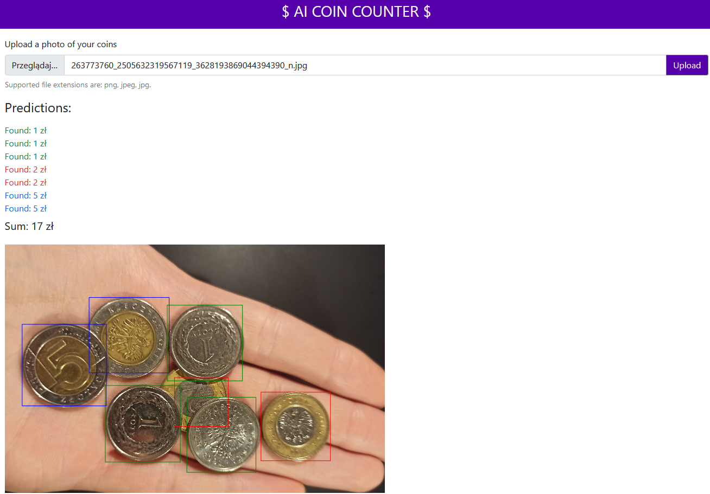

# AI Coin Counter app

<a href="https://coin-counter.azurewebsites.net" target="_blank">https://coin-counter.azurewebsites.net</a>

---

## Table of Contents

- [General Information](#general-information)
- [Used Dataset](#used-dataset)
- [Used Technologies](#used-technologies)
- [Development process](#development-process)
- [Architecture Diagram](#architecture-diagram)
- [How does it work](#how-does-it-work)
- [Demo](#demo)
- [Screenshots](#screenshots)
- [Team](#team)

---

## General Information

AI coin counter app is a web application which enables users to upload photos of coins and then return to them total value of these coins. Due to the lack of a big enough dataset the only coins that are detected are polish zloty: 1zl, 2zl, 5zl. By doing this project we wanted to address a problem of people having trouble counting little coins manually. It is mainly directed to saleswomen and salemen for whom it ease tasks of counting money. Moreover, during COVID pandemic solution like this could potentially decrease the amount of contact between people, by eliminating the necessity of touching money after other person.

Tha app was created as a 2-week project (no. 2) for a class "Introduction to applications and solutions based on Artificial Intelligence". The theme of a project was to create an app which brings some innovation to this world and has a potential of bringing benefits for people.

---

## Used Dataset

We created custom dataset of coin photos. We found some photos in the internet, but the vast majority of them were taken by ourselves. Because of that the size of the dataset was not very impressive. We have managed to gather XXX photos for our model.

---

## Used Technologies

- `Custom Vision Service - Azure`
- `Azure Storage`
- `Azure Web Services`
- `React.js 17.0.2`

---

## Development process

- Making photos of coins for a training model
- Creation of prediction (detection) system using one of Azure Cognitive Services - `Custom Vision`.
- Implementation of a frontend application using `React.js`.
- Connecting trained model with a frontend application using `REST API` and `Azure Storage`.
- Storing keys in `Azure Key Vault` service to increase security.
- Deployment of application using `Azure Web Services`.

---

## Architecture Diagram

Diagram do zrobienia

---

## How does it work

1. A user opens the web application (hosted in `Azure App Service`), then uploads a photo of some coins (Polish złoty) and
   clicks the Upload button.
2. The web application sends the image to `Azure Blob Storage`.
3. `Azure Blob Storage` returns a url of the uploaded resource.
4. The web application sends the image url to `Custom Vision API`.
5. `Custom Vision API` returns predictions (detections) of coins.
6. The web application sums a total value of coins and presents it to the user.

---

## Demo

See a demo (in polish):

---

## Screenshots

- Przykładowe działanie:

- Przykładowe działanie:

---

## Team

[Franciszek Wysocki](https://github.com/wysockif)

[Krzysztof Kowalski](https://github.com/KKofta)

[Patryk Peszko](https://github.com/Peszko-Patryk)

Krzysztof Szałankiewicz
